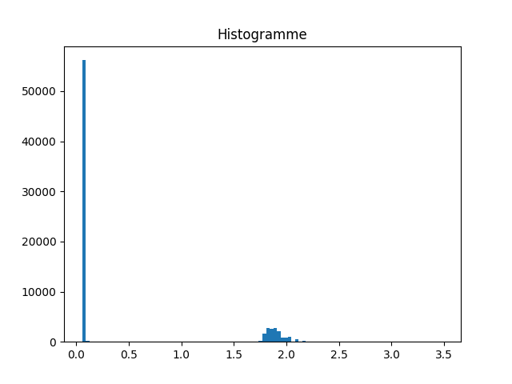

# Informations générales

## Installation

Pour utiliser ce dépôt, il faut avoir Python version >= 3.5.  
Installer les dépendances avec `pip3 install -r requirements.txt`.

Ce projet utilise tkinter pour avoir une interface graphique.

Le _dataset_ doit être placé directement dans le dossier `data`, de façon à avoir les fichiers placés comme ceci : `data/0/3dradiology.stanford.edu_`

## Utilisation

### GUI

Pour utiliser ce projet avec la GUI, il suffit de lancer `python3 src/gui.py`.  
Il est à noter que lors de la première utilisation, l'index inversé va être créé ce qui prend quelques minutes.

Une fois la GUI lancée, il est possible de rechercher les fichiers du dataset dans la barre de recherche. Deux types de recherches sont disponibles :

- Booléenne : si la recherche ne contient pas de mot-clé booléen (`and`, `or`, `and not`), le mot-clé `and` sera rajouté entre chaque mot de la requête.
- Vectorielle

### Tests

Pour tester les recherches avec des requêtes d'exemple dans `queries/`, il est possible de faire `python3 src/test.py`.

#### Format du fichier de test

Pour rajouter des cas au test, il suffit de rajouter la requête au fichier `queries/queries.txt` en respectant le formalisme suivant:

- une première ligne contenant la query
- une seconde ligne avec le lien vers le fichier d'output correspondant (chemin absolu ou elatif **à partir de la racine du projet**. ex: `queries/ouput/1.out`)

#### Résultats

Le résultat pour chaque query se présente sous cette forme :

```
Requête : stanford computer science
Modèle : Vectoriel
Précision : 0.05759625461028621
Rappel : 1.0
Requête : stanford computer science
Modèle : Boolean
Précision : 0.9988199197545433
Rappel : 1.0
```

Cela permet d'obtenir rapidement les deux métriques principales pour chaque modèle : la précision (nombre de documents pertinents retournés \ nombre de documents retournés) et le rappel (nombre de documents pertinents retournés / nombre de documents pertinents).

# Détails des choix

## Index inversé

L'index inversé sauvegarde pour chaque mot du vocabulaire :
`MOT,3 0/admission.stanford.edu_counselors_counselor_mailing_list.html,1;1, 0/admission.stanford.edu_application_deadlines_fee.html,1;69, 0/cdc.stanford.edu_,1;112`.
On a le mot de vocabulaire, le nombre de fichier contenant ce mot de vocabulaire, puis pour chaque fichier concerné son nom, le nombre d'occurence du mot dans le fichier et leur position.

La collection étant déja tokenizé, nous n'avons pas eu le besoin de tester différentes manières de le faire.
Après avoir extrait la liste des tokens de chaque documents, on enlève les mots trop récurrents que l'on nommera par la suite stop words. Nous avons choisi une liste de stop words classique qui permet de supprimer les mots les plus courrants de la langue anglaise (a, an, the, very ...).
La collection est ensuite lemmatizé. C'est à dire que chaque mot est réduit à sa forme de base, i.e. on retire les marques de genre, de pluriel et si besoin les conjugaisons. Ainsi, studying devient study, horses devient horse ... Nous avons préféré ceci au stemming.
Le stemming se content d'extraire la racine d'un mot grâce à un algorithme qui analyse notamment les préfixes et suffixes. Cependant cela a plusieurs inconvénients. Premièrement, la racine du mot n'est pas forcément un mot du dictionnaire (ex: dividing --> divid qui n'existe pas). Deuxièmememt, plusieurs mots différents sémantiquement peuvent avoir la même racine (ex: universal et university donne univers). Enfin, deux mots équivalent peuvent avoir une racine differente (ex: better et good, on deux racines différentes). C'est pour ces raisons que nous avons choisi de lemmatizer notre collection. Notons quand même que le stemming permet généralement d'augmenter le rappel et qu'il est rapide.
A contrario, la lemmatization utilise une base de donnée de lemme pour la langue de la collection, et non un algorithme. Ainsi, des mots comme good et better auront la même racine (good) et university et universal auront des racines différentes. On augmente grandement notre précision ainsi. Par contre cela requiert d'voir accès à une telle base donnée. De plus, pour fonctionner correctement, il faut préciser la fonction du terme dans le texte pour que le lemmatizer fonctionne. En effet, si better est traité comme un nom (ce qui est le comportement par défaut) la racine est better alors que si l'on précise au lemmatizeur que ce mot est un adjectif, alors la racine sera good. Nous avons donc dû ajouter une fonction qui donne la fonction du terme (en fonction notamment des suffixes du mots comme ing ou ed). Cette fonction utilise le module wordnet de la bibliothèque nltk pour déterminser la fonction du terme. Mais cette fontion a ses limites et le résultat pourrait être améliorer avec, soit une anotation de la fonction de chaque mot (long et fastidieux) ou grâce à une fonction plus précise qui analyse sémantiquement le texte. Enfin, la lemmatization est un processus assez lent ce qui rend la création de l'indexe plus lente.

Note: il faut aussi lemmatizer la requête pour que les termes puissent être retrouvé dans l'index.

## Modèle booléen
Nous avons implémenté un modèle booléen pour avoir un modèle de base pour effectuer la recherche dans nos documents.

Dans ce modèle booléen, la requête doit contenir des operateurs binaires supporté par ce modèle, c'est-à-dire 'or', 'and' ou 'and not'. Dans le cas où aucun opérateur n'est présent, nous ajoutons automatiquement des opérateurs 'and' entre chaque mot. De plus, si un token n'existe pas dans l'index inversé, on préfère l'ignorer. Cela permet de bien gérer les *stop words*.
On obtient alors à la fin une liste de fichiers satisfaisant la requête. Cependant, cette liste n'a pas vraiment d'ordre, puisqu'un fichier est soit sélectionné, soit laissé de côté. Le choix a donc été fait d'ordonner les résultats par ordre alphabétique pour avoir un comportement bien connu.

On remarque que le modèle booléen colle presque parfaitement aux résultats des requêtes d'exemples. On peut donc en conclure que ces requêtes d'exemples ont été faite avec un modèle boolléen et uniquement des opérateurs 'and' entre chaque mot.

## Modèle vectoriel

### Pourquoi un modèle vectoriel ?

Nous avons choisi d'implémenter un modèle vectoriel car ce modèle permet d'exprimer les requêtes dans un langage beaucoup plus proche du langage naturel. De plus, celui-ci permet donner un poids différent aux termes de la requête, notamment en faisant un tf-idf sur ceux-ci. Enfin, le modèle vectoriel renvoie un résultat scoré et trié ce que permet d'afficher en priorité le résultat qui semblent les plus pertinents. Cela facilite grandement le travail de recherche.

### Mesure de similarité

Pour retourner les résultats pertinents, le modèle vectoriel se base sur une mesure de similarité entre le vecteur représentant la requête et le vecteur représentant le document dans l'espace du vocabulaire de la collection.
Nous avons choisis une mesure de similarité cosinus car c'est l'une des plus utilisée:
sim(Q, D) = (Q.D)/(||Q||x||D||)

Cette mesure a néanmoins un inconvénient : elle ne tient pas compte de la proximité physique de deux mots dans le texte.

Pour obtenir les vecteurs Q et D, on calcule pour chaque terme son TF-IDF dans la collection. On calcul plus précisément un tf normalizé par le max pour que la longueur du document n'influ pas sur la valeur du score calculé.


### Pourquoi de si mauvaises performances ?

Malgré de nombreuses tentatives pour améliorer les performances de notre modèle vectoriel celui garde des performances faibles (sur les requêtes de test) en comparaison à notre modèle booléen.

Ce que l'on peut voir, si l'on trace l'histogramme de nos scores (non normalisés), c'est qu'on a plusieurs "clusters" distribués suivant une loi normale et une barre proche de 0. Nous avons donc essayé de sélectionner ces clusters pour retourner seulement les résultats pertinents, mais la précision n en était pas améliorée, comparé à un simple filtre sur la liste pour supprime la bande 0. C'est pour cela que nous avons conservé ce filtre dans notre version final car nos tentives précédentes ralentissaient la requête.


Comment peut-on expliquer ces performances:

- les requêtes d'exemple utilisent beaucoup de mots considérés comme stop words (a, the, very ...) ce qui rend compliqué d'avoir une bonne précision.
- les requêtes d'exemples sont très générale et ne permettent pas de tester la spécificité de la collection. Par, le mot stanford revient très souvent, ce qui n'est pas très pertinent pour une collection venant de stanford.
- Enfin, ces requêtes font à l'origine partie d'un cours de stanford (CS276) et sont utilisés pour tester uniquement un modèle booléen, le modèle vectoriel n'ayant pas encore été abordé dans le cours. Ainsi, il semble logique que le modèle booléen ait de meilleures performances. Enfin, il nous semble que ces requêtes de test ne sont pas le résultat d'une analyse de la collection mais seulement le résultat d'un modèle booléen utilisé par le professeur. Ce pourrait expliquer les mauvaises performances du modèle vectoriel car celui-ci accorde une plus grande part à la pondération entre les différents termes.
